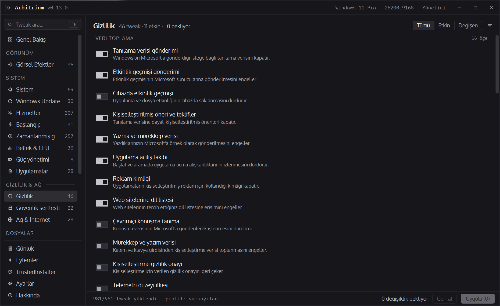
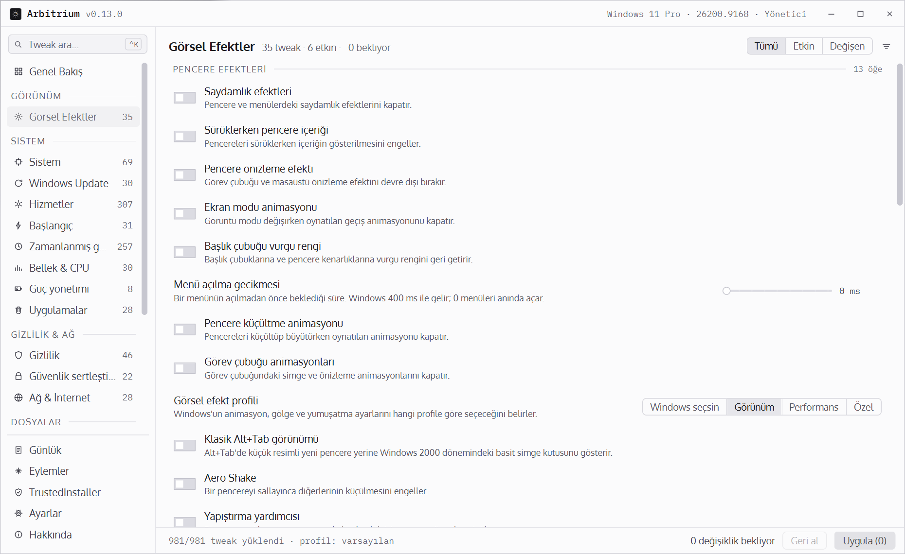
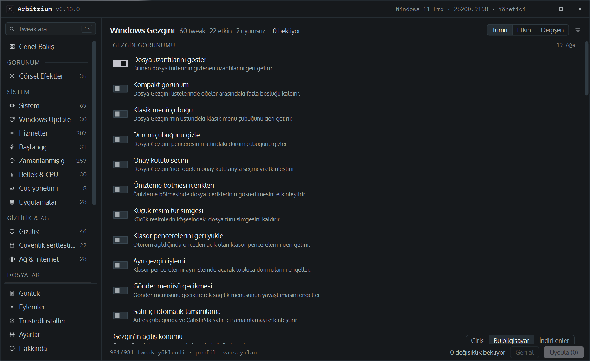
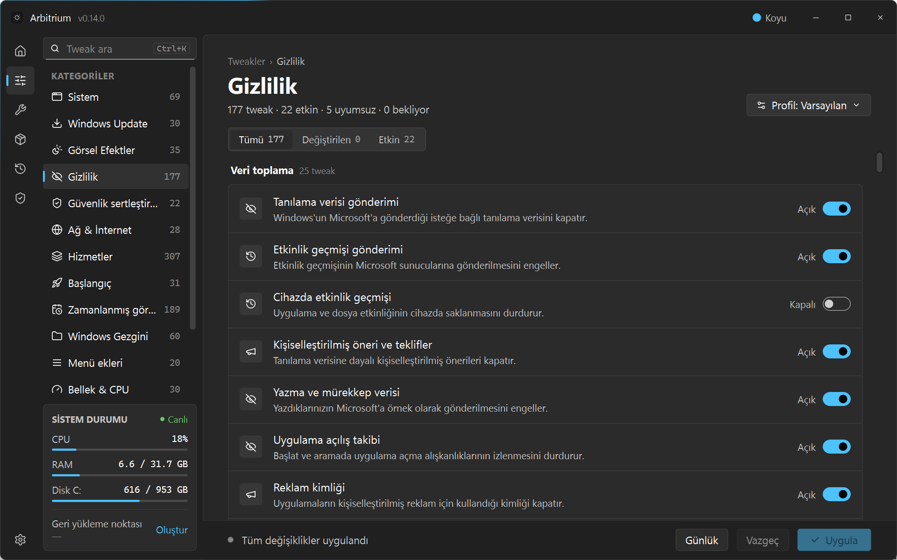
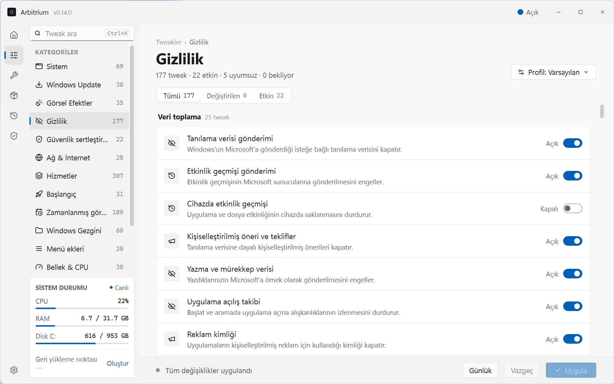
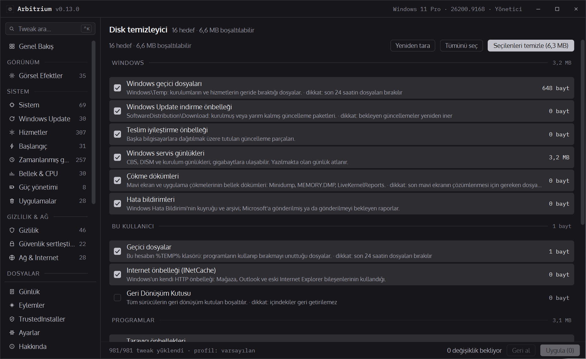
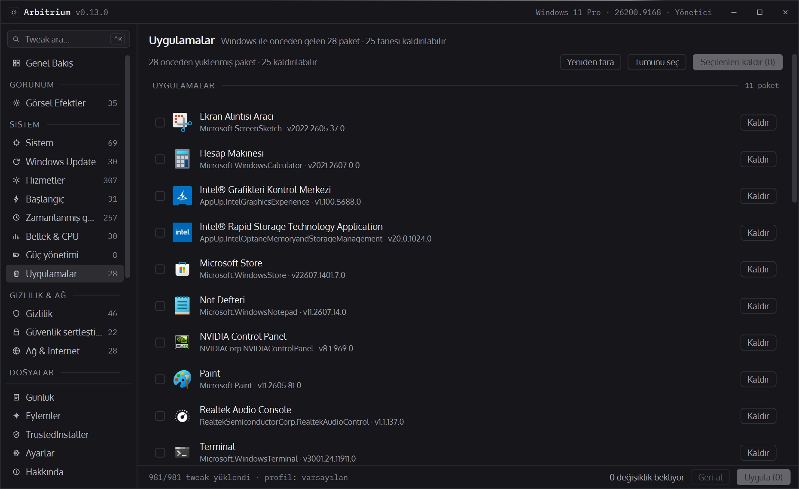
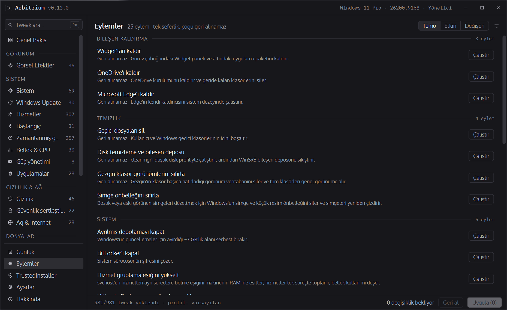
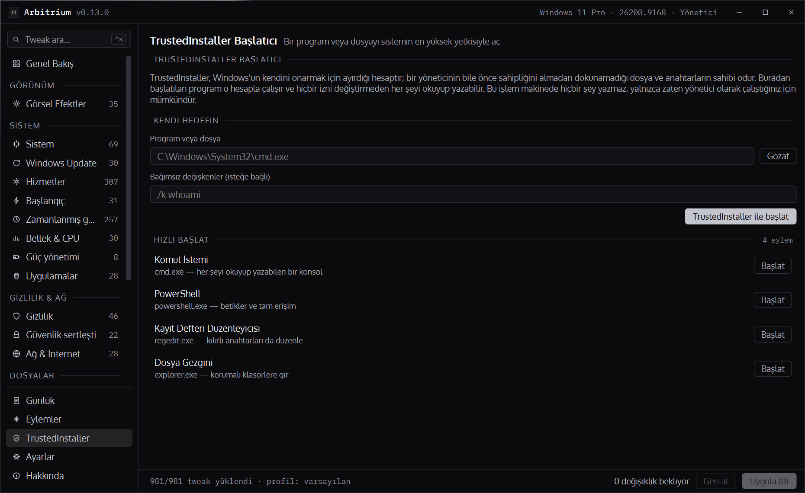
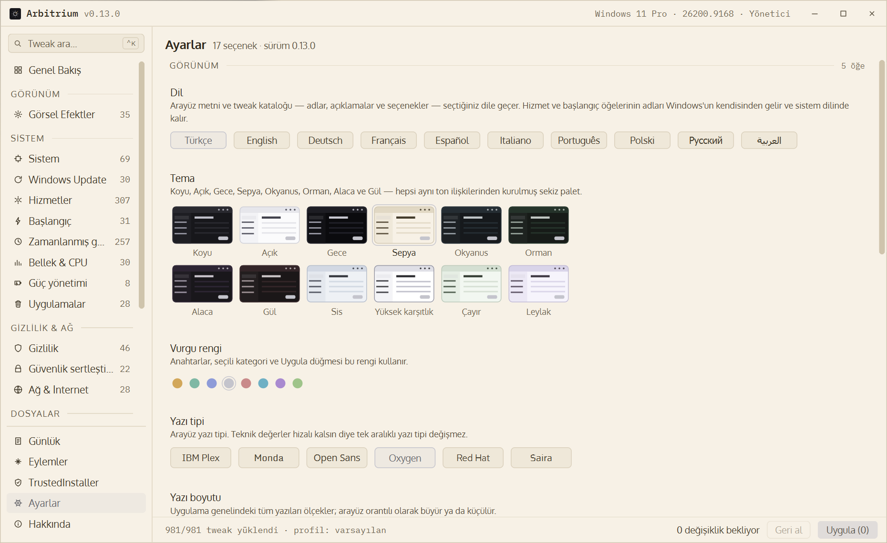

<div align="center">


# Arbitrium

**Your Windows. Your rules.**

A Windows tweaker that shows its work. 669 tweaks, every service, every scheduled task and
every startup entry on your machine — as switches. Nothing is written until you press *Apply*,
and everything that is written is journalled and reversible.

[](https://github.com/shadesofdeath/Arbitrium/releases/latest)
[](https://github.com/shadesofdeath/Arbitrium/releases)
[](https://github.com/shadesofdeath/Arbitrium/actions/workflows/ci.yml)
[](#getting-started)
[](#every-word-in-ten-languages)
[](LICENSE)

**[⬇ Download the latest release](https://github.com/shadesofdeath/Arbitrium/releases/latest)** — one portable `.exe`, no installer, nothing to unpack.

<br>



</div>

---

## Every other tweaker asks you to trust it. This one shows its work.

Most "optimizers" are a wall of checkboxes and a promise. You click *Apply*, something happens
somewhere, and if your machine acts strange next Tuesday — good luck. Arbitrium was built by
someone who got tired of that deal.

- **Nothing is written until you say so.** Flip as many switches as you like. Nothing touches
  your system until you press *Apply* — and the status bar counts exactly how many changes are
  waiting while you decide.
- **Every write is recorded, and reversible.** Before a value is changed, Arbitrium records
  what was there: the old data, its type, and whether the key existed at all. The **Log** page
  reads that history back and lets you revert any single change, individually, even months
  later — even for a tweak that has since been rewritten or removed. Not "restore defaults".
  *Your* value, the one that was actually on *your* machine.
- **It reads the machine, not a list.** The state of every switch comes from the registry at
  startup. Services, startup entries and scheduled tasks are enumerated from the machine
  itself. A tweak that does not apply to your Windows build is greyed out with the reason
  rather than offered as a switch that quietly does nothing.
- **No black boxes.** Every one-shot action shows you the exact script it will run, in full,
  before it runs. Read it, then decide.

---

## What's inside

<table>
<tr>
<td width="50%"></td>
<td width="50%"></td>
</tr>
<tr>
<td align="center"><sub><b>Visual Effects</b> · light theme · switches, sliders and segmented choices</sub></td>
<td align="center"><sub><b>File Explorer</b> · Ocean theme · rows that don't apply to this build are marked</sub></td>
</tr>
<tr>
<td></td>
<td></td>
</tr>
<tr>
<td align="center"><sub><b>Fluent shell</b> · dark · the Windows 11 layout, switched from Settings</sub></td>
<td align="center"><sub><b>Fluent shell</b> · light · same pages, its own two palettes and blue accent</sub></td>
</tr>
<tr>
<td></td>
<td></td>
</tr>
<tr>
<td align="center"><sub><b>Disk cleaner</b> · measured before anything is deleted</sub></td>
<td align="center"><sub><b>Apps</b> · what this Windows actually came with, real icons and all</sub></td>
</tr>
<tr>
<td></td>
<td></td>
</tr>
<tr>
<td align="center"><sub><b>Actions</b> · one-shot, script shown before it runs</sub></td>
<td align="center"><sub><b>TrustedInstaller</b> · Midnight theme · launch anything as the account that owns Windows</sub></td>
</tr>
</table>

### ⚙️ 669 tweaks that actually apply here

Not a generic list scraped from a 2016 forum post. Arbitrium checks each tweak against **your**
Windows build. A setting Microsoft retired three versions ago isn't quietly presented as a working
switch — it's shown greyed out, with the reason. Honesty over a longer feature list.

Two shells, one catalogue. The classic sidebar layout every page was designed in, and a
**Fluent** shell — the Windows 11 layout: an icon rail, a category pane with a live status
card, grouped tweak cards and an apply bar, in Segoe UI with its own dark and light palettes.
Switch between them under Settings › Appearance, right under the language; the pages stay, the chrome around them is
rebuilt on the spot.

The price is stated before the benefit, too. A row whose "on" position takes a convenience
away — clipboard history, an app permission, a Start section — says **Has a cost** in amber
ahead of its description; one that touches security, updates or activation says **Not
recommended** in red. Most rows wear neither, which is what makes the two that do worth
reading.

| | |
|---|---|
| **System** · 86 | Core behaviour, lock screen, sign-in, shell policy, AI and cloud features |
| **File Explorer** · 77 | Extensions, panes, Home and Gallery, launch target, Start menu |
| **Privacy** · 194 | Telemetry, diagnostics, advertising ID, activity history, app permissions |
| **Visual Effects** · 35 | Animations, transparency, shadows, thumbnails |
| **Memory & CPU** · 33 | Paging, caching, prefetch, scheduling, gaming |
| **Windows Update** · 34 | Deferral, drivers, delivery optimisation, restart behaviour |
| **Network & Internet** · 37 | DNS, IPv6, Teredo, discovery, metered connections |
| **Security hardening** · 46 | SMB, LSA, PowerShell logging, legacy protocols, SmartScreen |
| **Cleanup** · 24 | Storage Sense, temp, component store, event logs |
| **Startup** · 30 | Sign-in behaviour, Num Lock, lock screen |
| **Context menu** · 20 | Take Ownership, run as different user, cascading power plans, and more |
| **Advanced** · 30 | The ones with sharp edges |
| **Power management** · 23 | Sleep, hibernation, USB selective suspend |

A switch is the simple case. Where Windows offers positions rather than on/off — a service's
start type, Explorer's launch target, how much of the disk Delivery Optimization may use — the
row is a segmented control or a slider, and a profile remembers the *position*, not a bool.

### 🔧 Every Windows service, in one place

Every Win32 service on your machine — three hundred-odd — each as a four-position control:
*Automatic*, *Delayed*, *Manual*, *Disabled*. Services Windows genuinely cannot boot without are
**locked**, with the reason stated; the ones you might well want off but that cost something
(Defender, Windows Update, the firewall, search) say what stops working, right on the row.

### ⏱️ Every scheduled task, the same way

The Task Scheduler holds a couple of hundred tasks on an ordinary machine, forty of them hidden,
and that is where the telemetry uploaders, the compatibility appraisers and the vendor updaters
actually live. Arbitrium lists **all of them**, grouped by folder the way Task Scheduler does,
each one a switch. Rows that cost something say so up front — Defender's scans, the update
orchestrator, System Restore, TRIM — and the handful Windows protects with an ACL that turns even
an administrator away are shown **locked** with the reason, rather than as a switch that fails.
Every change is journalled and reverts like any other.

### 📦 Debloat that reads your actual machine

The Apps page doesn't guess from a hardcoded list of app names. It asks Windows which packages
were **preinstalled with your image**, then reads each one's real icon out of its own package
folder. What you see is what you actually have — real names, real logos, real version numbers.

Removal takes the app off **every account** on the machine and deprovisions it, so it doesn't
come back the next time someone new signs in. Shared runtimes and anything Windows itself marks
protected are shown with a padlock instead of a button — visible, but not a foot-gun.

### 🧹 A disk cleaner that measures before it deletes

Sixteen targets in four groups — Windows' temp and update caches, servicing logs, crash dumps and
error reports; this user's temp and Internet cache and the recycle bin; the caches of six
browsers, GPU shader caches, Discord, Teams, Steam, Spotify and the Store; and, kept apart and
unchecked, the ones with a cost: Prefetch, a previous Windows installation, old restore points
and the component store. Each is **measured in the background** first, so the number on the row
and the figure in the sidebar are what a clean would actually free, not a guess. Files in use
are skipped and counted, nothing goes through the Recycle Bin, and the confirmation lists exactly
which targets and how much.

### ⚡ 25 one-shot actions

Remove Edge, OneDrive, or Widgets. Empty temp folders and the component store. Rebuild the icon
cache. Switch DNS to Cloudflare, Google, or Quad9 in one click. Add the hidden **Ultimate
Performance** power plan. Each one tells you up front whether it can be undone — and shows you
the script.

### 🛡️ Launch anything as TrustedInstaller

The account that owns the files and registry keys even an administrator is refused. Point the
**TrustedInstaller** page at a program or a file — or use the one-tap shortcuts for a shell,
PowerShell, the registry editor, or the file manager — and it starts under that account, able to
read and write all of it without changing a single permission. No service to install, no token
juggling; it uses the elevated session the app already runs in. `whoami` in the launched shell
says `nt service\trustedinstaller`, which is the whole point.

### 🧭 God Mode

Thirty-eight of Windows' own settings pages, applets and consoles — the ones you can never find
in the Settings app — behind one searchable list. Every row opens the real Windows dialog;
Arbitrium writes nothing on its behalf.

### 📊 A dashboard that isn't decoration

Live CPU and memory graphs at one-second resolution, alongside **30 blocks** of the machine facts
you actually go looking for: activation state, Secure Boot, TPM, BIOS and SMBIOS, core isolation,
uptime, pending restarts and *why*, last restore point, every network adapter, every volume — plus
BitLocker and SMART per drive, Windows Update state, driver problems, privacy posture,
virtualisation, accounts and the last bugcheck code. Sensors read what the machine actually
exposes: the ACPI thermal zone, the GPU's temperature, fan, load, VRAM, power draw and PCIe link
through the NVIDIA driver (load and VRAM through Windows' own counters on any card), and battery
health, cycles and chemistry through `powercfg`'s report on laptops whose firmware skips the WMI
battery classes. A protection block reads every antivirus the Security Center knows, Defender's
signatures and last scan, tamper protection, and the firewall per profile.

Nothing here blocks the window. The heavy reads arrive in three stages behind the page, and a
value that genuinely cannot be read says so rather than guessing. Reading the machine creates
nothing on it — not even an empty registry key.

### 💾 Profiles that travel

Save your entire configuration as a portable XML profile and apply it on the next machine — every
tweak, service, task and startup entry in one file, each remembered as the *position* it sits at
rather than a bare on/off, plus your theme, language and settings if you want them along. Or
export just your pending changes as a plain **`.reg`** file that Windows understands without
Arbitrium anywhere in sight. Your setup shouldn't be a hostage.

### 🛡️ A safety net you can see the state of

Settings shows the date of your last System Restore point and puts Windows' own System Protection
window one click away. Arbitrium does not create the point for you: creating one changes the
system, and this build writes nothing you did not ask it to. Knowing whether you have a net, and
being one click from making one, is the part software can honestly do for you.

---

## Every word, in ten languages

Not just the buttons — **everything**. All 669 tweak names and descriptions, every service state,
every action, every label on the dashboard, every line in the log.

🇹🇷 Türkçe · 🇬🇧 English · 🇩🇪 Deutsch · 🇫🇷 Français · 🇪🇸 Español · 🇮🇹 Italiano · 🇵🇹 Português · 🇵🇱 Polski · 🇷🇺 Русский · 🇸🇦 العربية

Switch language from Settings and the entire interface changes instantly. No restart. Not even a
flicker.

---

## Looks like it belongs on your desktop

<div align="center">

</div>

Because a tool you'll actually open should be worth looking at.

- **Twelve themes** — Dark and Light, a deeper Midnight and a warm Sepia, four gently tinted darks
  (Ocean, Forest, Dusk, Rose) and four lights (Mist, High contrast at AAA, Meadow, Lilac), each a
  full palette rather than an inversion, every one measured for contrast
- **Eight accent colours** you can pick, applied across the whole interface
- **Six typefaces** to choose from, and **four text sizes**, because not everyone runs a 4K panel
  at 100%
- A **frameless window** with smooth scrolling and animation everywhere it earns its place — and
  its own dialogs, so nothing on screen looks like a different program interrupting this one

---

## Getting started

1. Download **`Arbitrium-vX.Y.Z-win64.exe`** from the
   [latest release](https://github.com/shadesofdeath/Arbitrium/releases/latest). That single file
   *is* the application — Qt is linked into it, so there is nothing to unpack and nothing to put
   beside it. (The `.zip` next to it holds the same executable, this README, the licence and a
   `licenses/` folder for everything inside the binary that is not this project's to relicense —
   for anyone whose browser dislikes a bare `.exe`.)
2. Run it. **No installation, no setup wizard, no bundled toolbar.** One executable. Windows will
   stop you once on the way; [what it says, and what you can check instead of taking my word for
   it](#windows-will-warn-you-about-this-file), is a section of its own.
3. On first launch, pick your language and your look.
4. Flip what you want. Press **Apply** when you mean it.

> Arbitrium needs administrator rights — it edits system-level settings, and pretending otherwise
> would be dishonest. It asks once, at launch.

It keeps itself current, too: a check on launch (at most once a day, and only if you leave it on)
offers a newer release with its notes; accepting downloads the executable, verifies its published
SHA-256, swaps it into place and restarts. Nothing is installed and nothing runs in the background.

---

## Windows will warn you about this file

Between *download it* and *it opens* there are two dialogs the list above doesn't mention.

The first is Microsoft Defender SmartScreen: a dialog headed **Windows protected your PC**, saying
it *prevented an unrecognized app from starting*, with one button — **Don't run**. The way past it
is **More info**, which unfolds the file name, *Publisher: Unknown publisher*, and a **Run anyway**
button. The second is the administrator prompt, which for a file like this one asks whether you
want to allow *this app from an unknown publisher* to make changes to your device.

Both are telling you the truth. Arbitrium's executable carries no Authenticode signature, and that
is a decision rather than an oversight. A certificate that changes those two dialogs starts at a
couple of hundred dollars a year, has to be kept on a hardware token or a cloud HSM since the
CA/Browser Forum began requiring that in June 2023, and — in the kind an individual can actually be
issued — replaces *Unknown publisher* with a legal name, checked against documents a certificate
authority keeps on file. It would not even clear that first dialog on day one: SmartScreen is
reputation-based, and a certificate that has never signed anything has no reputation either.

So instead of asking you to trust a pseudonym, here is what you can check. Every release carries
three files — the executable, the zip, and `Arbitrium-vX.Y.Z-win64.sha256`.

**The sums file tells you the download is whole.** It holds one line each for the executable and
the zip, taken from the exact bytes that were uploaded.

```powershell
Get-FileHash Arbitrium-vX.Y.Z-win64.exe -Algorithm SHA256
```

Compare that against the matching line in the `.sha256` — PowerShell prints uppercase and the file
is lowercase, and that should be the only difference. What it is worth is narrow enough to say out
loud: it catches a download that arrived truncated or corrupted, and nothing else. Anyone who could
replace the executable on a release could replace the sums file in the same motion.

**The attestation tells you where the binary came from.** At publish time GitHub signs a statement
binding the digest of the executable and of the zip to this repository, the commit they were built
from, and the workflow run that built them. Checking that statement needs no key from anyone — only
the GitHub CLI, signed in:

```powershell
gh attestation verify Arbitrium-vX.Y.Z-win64.exe --repo shadesofdeath/Arbitrium
```

A file that is not byte for byte what that run produced has no attestation for its digest, and the
command fails. One that is prints back the repository and the workflow file that built it, with the
commit itself one `--format json` away — and that repository is the one you are reading, which is a
better reason to press **Run anyway** than a certificate would have given you.

---

## Building from source

Qt 6 (Widgets, Svg, Network), CMake 3.16 or newer, and a C++17 compiler. The shipped executable
is a MinGW build against a static Qt; a shared Qt from the Qt installer works just as well for
development, and CMake copies the runtime next to the executable after every link.

```powershell
cmake -S . -B build -G Ninja -DCMAKE_PREFIX_PATH=C:/Qt/6.11.1/mingw_64
cmake --build build --parallel
```

The tree builds with zero warnings under `-Wall -Wextra -Wshadow`, and it should stay that way.
The three data files the application is built around — the tweak catalogue, the actions and the
translations — have a checker of their own that needs nothing but Python:

```powershell
python tools/check-data.py
```

[`ci.yml`](.github/workflows/ci.yml) runs both on every commit.
[`release.yml`](.github/workflows/release.yml) builds the static Qt from the upstream tarballs,
links the single-file executable, publishes it with its checksums and attestation, and takes the
release notes from [`docs/release-notes/`](docs/release-notes). The changelog lives in
[`CHANGELOG.md`](CHANGELOG.md).

---

## Fair warning

This tool changes real Windows settings, and some of them matter. It gives you a log, per-change
revert, a shortcut to Windows' System Protection, and a confirmation on everything destructive —
but it also assumes you're an adult who read the description.

Start with a restore point. Change things in small batches. The Log page is right there if
something isn't what you expected.

---

## License

Arbitrium is released under the **[MIT License](LICENSE)** — read it, fork it, ship it, build
something else out of it. Keep the copyright notice with it and the rest is yours.

Three pieces inside it carry licences of their own, and they stay with the binary:

- **Qt 6.11** — statically linked, used under the [LGPL v3](https://www.qt.io/licensing). The
  release workflow, [`.github/workflows/release.yml`](.github/workflows/release.yml), builds that
  Qt from the upstream tarballs and records every configure flag it was built with — which is what
  you need to reproduce this binary, or to relink it against a Qt of your own. The LGPL-3.0 text
  sits in [`resources/licenses/`](resources/licenses), beside the GPL-3.0 whose terms its own
  opening paragraph incorporates.
- **Six typefaces** — IBM Plex, Monda, Open Sans, Oxygen, Red Hat Text and Saira, every one of
  them compiled into the executable through [`resources.qrc`](resources/resources.qrc) and every
  one under the SIL Open Font License 1.1, with a [`LICENSE-*.txt`](resources/fonts) of its own.
- **lucide** — the glyphs that title the Overview cards, under the
  [ISC License](https://github.com/lucide-icons/lucide/blob/main/LICENSE). They are compiled into
  [`src/icons.cpp`](src/icons.cpp) as path data rather than shipped as files, and the text in
  [`resources/licenses/`](resources/licenses) is the upstream licence in full, because a few of
  the glyphs used here are on its Feather-derived list and carry that project's MIT notice in the
  same file.

The release zip carries all nine of those files in a `licenses/` folder, so a downloaded copy is
complete without the repository beside it.

---

<div align="center">


### Built by [ShadesOfDeath](https://github.com/shadesofdeath)

If Arbitrium saved you an afternoon of registry spelunking, you can say thanks:

[](https://buymeacoffee.com/berkayay)

**[Report a bug](https://github.com/shadesofdeath/Arbitrium/issues)** · **[Star the repo](https://github.com/shadesofdeath/Arbitrium)** · **[Releases](https://github.com/shadesofdeath/Arbitrium/releases)**

</div>
